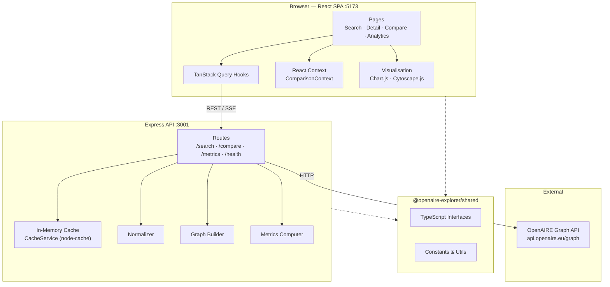

# Architecture

## System Overview



---

## Data Flow

### Search Query

```
User input (SearchPage)
  → useSearchResearchProducts hook
  → GET /api/search/research-products?search=...&page=1
  → validate() middleware (Zod schema)
  → OpenAIREClient.searchResearchProducts()
  → OpenAIRE Graph REST API
  → raw PaginatedResponse<ResearchProduct>
  → paginated() envelope  { data[], meta{page,pageSize,totalResults,totalPages} }
  → TanStack Query cache (stale: 5 min)
  → SearchResultsList component
```

### Comparison

```
User clicks "Add to comparison" (up to 5 entities)
  → ComparisonContext.addEntity()
  → User navigates to /compare
  → useComparison hook
  → POST /api/compare  { entities:[{id,type}], filters:{fromYear,toYear} }
  → compareRouter resolves each entity in parallel:
      org/project → getEntity() + fetchProducts() via cursor pagination (≤500)
      research-product → getResearchProduct() → [product]
  → computeEntityMetrics() per entity
  → ComparisonResult  { entities[], metrics[], computedAt }
  → compareCache (10-min TTL, key = sorted entity IDs + filters)
  → ComparePage charts
```

### Analytics (OA Distribution / Trends / Network)

```
AnalyticsPage mounts with filter state
  → useOADistribution / useTrendsData / useNetworkData hooks
  → GET /api/metrics/{oa-distribution|trends|network}?...
  → fetchProducts() cursor-paginator (≤2000 products, capped at 500 for network)
  → compute*(products) in-process
  → metricsCache (5-min TTL)
  → Chart.js / Cytoscape.js visualisation
```

### SSE Stream

```
AnalyticsPage requests progressive OA data
  → GET /api/metrics/oa-distribution/stream (SSE)
  → streamProducts() fetches pages sequentially
  → each page → res.write("data: {...}\n\n")
  → client accumulates partial results → live chart updates
```

---

## Module Descriptions

### Search (`packages/server/src/routes/search.routes.ts`)

Exposes paginated search and single-entity detail for the three OpenAIRE entity types. Uses offset-based pagination for normal searches. The `/related` and `/products` sub-routes discover related entities by first fetching the parent's linked project or organisation ID, then re-querying.

### Comparison (`packages/server/src/routes/compare.routes.ts`)

Accepts 1–5 `{id, type}` pairs plus optional year filters. Resolves entities concurrently (`Promise.all`). For orgs and projects it uses cursor pagination to aggregate up to 500 products before computing metrics. The cache key is built from **sorted** entity IDs so request order doesn't create duplicates.

### Analytics / Metrics (`packages/server/src/routes/metrics.routes.ts`)

Three read-only GET endpoints sharing the same filter schema. All use cursor pagination up to 2 000 products (500 for network). Results are computed in-process by `metrics-computer.ts` and `graph-builder.ts`, then cached for 5 minutes.

### Network Graph (`packages/server/src/lib/graph-builder.ts`)

**Algorithm:**
1. Collect all author `{fullName}` strings across the product set.
2. For each product, create edges between every pair of co-authors (complete sub-graph per paper).
3. Aggregate edge weights (shared publications count).
4. Trim to `maxNodes` (default 100) by descending degree centrality.
5. Compute graph metrics: node count, edge count, density `(2E / N(N-1))`, average degree, connected components (BFS), top-N nodes by degree.

---

## State Management

| Concern | Mechanism |
|---------|-----------|
| Server data (search results, entity detail) | TanStack Query — stale 5 min, 1 retry |
| Comparison basket (cross-page) | React Context (`ComparisonContext`) + `useReducer` |
| UI state (filters, active tab) | Local `useState` within each page |
| Dark/light mode | CSS class on `<html>` + `localStorage` |

TanStack Query is the single source of truth for all remote data. The `ComparisonContext` is the only global client-side state and intentionally does not persist across page reloads — the comparison workflow is session-scoped.

---

## Caching Strategy

### Server-side (node-cache)

| Cache instance | TTL | Key pattern |
|---|---|---|
| `metricsCache` | 5 min | `metrics/{endpoint}:{sorted-params-json}` |
| `compareCache` | 10 min | `compare:{sorted-ids}:{filters-json}` |

`CacheService.buildKey()` serialises query params into a deterministic string. Cache warming (`cache-warmer.ts`) can optionally pre-populate common queries at startup.

### Client-side (TanStack Query)

All hooks pass `staleTime: 5 * 60 * 1000`. Query keys include every filter param so distinct filter combinations are cached independently.

---

## OA Classification Logic

The server normaliser maps OpenAIRE access-right codes to the four OA colours used throughout the UI:

```
bestOpenAccessRightLabel
  ├── "Open Access" + openAccessColor = "gold"   → gold
  ├── "Open Access" + openAccessColor = "green"  → green
  ├── "Open Access" + openAccessColor = "hybrid" → hybrid
  ├── "Open Access" + openAccessColor = "bronze" → bronze
  ├── "Open Access" (no colour)                  → green (fallback)
  ├── "Closed Access"                            → closed
  └── anything else                              → unknown
```

The `COAR_ACCESS_RIGHTS` constants in `packages/shared/src/constants.ts` map the raw COAR vocabulary codes (`c_abf2` = OPEN, `c_14cb` = CLOSED, etc.) used when filtering via the OpenAIRE API.

---

## Design System

- **Component library**: custom, built on Tailwind utility classes
- **Colour palette**: Tailwind default + OA-status colours defined in `oa-colors.ts`
- **Typography**: system font stack via Tailwind's `font-sans`
- **Spacing/sizing**: 4 px grid (Tailwind default)
- **Dark mode**: `class` strategy — toggling `.dark` on `<html>` flips Tailwind dark-mode variants
- **Accessibility**: semantic HTML, `role` attributes, `aria-label` on icon buttons, focus rings preserved
- **Component organisation**: feature-sliced — `components/{feature}/` rather than by type (e.g. `components/search/SearchBar.tsx` not `components/inputs/SearchBar.tsx`)
