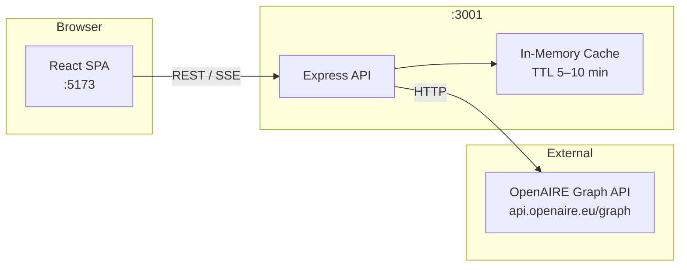

# 🔬 OpenAIRE Explorer Dashboard

> A full-stack research intelligence dashboard for exploring, comparing, and analysing open-access publications, organisations, and projects from the [OpenAIRE Graph](https://graph.openaire.eu/).

[](https://github.com/your-org/openaire-explorer/actions/workflows/ci.yml)
[](LICENSE)
[](https://www.typescriptlang.org/)
[](CONTRIBUTING.md)

<!-- Replace with actual screenshot -->
<!--  -->

---

## 🌱 Origins & Authorship

This repository was created and is maintained by **Quoc-Tan Tran**, Open Science Researcher at the Faculty of Sociology, Bielefeld University, with the technical assistance of Claude AI.

It started as a practical way to turn OpenAIRE Graph data into an interactive research interface that supports transparent exploration, evidence-informed comparison, and reusable analytics for open science work.

---

## 🎯 Vision

OpenAIRE Explorer aims to make open scholarly metadata easier to interpret and use in real research practice. The project focuses on:

- lowering barriers to evidence discovery across publications, organisations, and projects
- supporting comparative analysis for policy, institutional, and thematic questions
- encouraging reproducible, inspectable workflows for open science intelligence

---

## ✨ Features

| | Feature |
|---|---|
| 🔍 | **Advanced search** with faceted filtering by type, date range, OA status, and funder |
| ⚖️ | **Multi-entity comparison engine** – compare up to 5 publications, organisations, or projects side-by-side |
| 📊 | **OA distribution analytics** – gold / green / bronze / hybrid / closed breakdown by year |
| 📈 | **Trend analysis** with year-over-year growth rates and publication velocity |
| 🕸️ | **Research network visualisation** – interactive co-authorship and collaboration graphs via Cytoscape.js |
| 🌓 | **Dark / light mode** with system preference detection |
| ♿ | **ARIA-compliant accessibility** – keyboard navigable, screen-reader friendly |
| 📱 | **Mobile-first responsive design** built with Tailwind CSS |

---

## 🚀 Quick Start

### 1) Install dependencies

```bash
git clone https://github.com/your-org/openaire-explorer.git
cd openaire-explorer
npm install
```

### 2) Create the server env file

Use the command that matches your shell:

```bash
# macOS / Linux / Git Bash
cp packages/server/.env.example packages/server/.env
```

```powershell
# PowerShell (Windows)
Copy-Item packages/server/.env.example packages/server/.env
```

### 3) Start the app

```bash
npm run dev
```

The client will be available at **http://localhost:5173**.

The backend listens on **http://localhost:3001**, and the health endpoint is:

- **http://localhost:3001/api/health**

`http://localhost:3001/` returning `{"error":"Not found","code":"NOT_FOUND"}` is expected because routes are under `/api/*`.

### 4) Example workflows in the client interface

#### Compare tab example

1. Open `http://localhost:5173/search` and search for a topic (for example: `open science`).
2. Add 2-5 items to comparison from the result cards.
3. Go to the **Compare** tab.
4. Review side-by-side metrics and visual differences in OA status, publication year patterns, and metadata completeness.

#### Analytics tab example

1. Open the **Analytics** tab.
2. Add widgets such as OA distribution, trends, and top nodes.
3. Apply global filters (year range, entity scope) to focus on one topic or period.
4. Use the combined dashboard to inspect changes in OA composition and publication dynamics over time.

### Prerequisites

- Node.js ≥ 20
- npm ≥ 10

---
## 🚀 How to Deploy Your Project to the Web

Since your project has a **Client** (the website you see) and a **Server** (the "brain" that handles data), we have to put them in two different places.

### 1. The Big Picture

Think of this like moving into a new house. You can't just move your furniture (Client) without making sure the utilities like water and power (Server) are hooked up at the new address first.

### Phase 1: Prepare your "Brain" (The Server)

Before touching Vercel, your backend must be online. Vercel is great for websites, but it isn't designed to run permanent "always-on" servers.

1. **Deploy your Server:** Use a service like [Render](https://render.com), [Railway](https://railway.app), or [Fly.io](https://fly.io).

2. **Get your Public URL:** Once deployed, you will get a link that looks like `https://my-api-server.onrender.com`.

3. **Test it:** Open that link in your browser. If you see a "Welcome" message or a health check, you are ready.

> **⚠️ Important:** You must update your Server's **CORS** settings to allow your new Vercel website to talk to it. Usually, this means adding your Vercel URL to your server's `.env` file or configuration.

### Phase 2: Deploy your Website (Vercel)

Now that the server is live, let's put the interface online.

1. **Login to Vercel:** Go to [vercel.com](https://vercel.com) and click **"Add New Project"**.

2. **Connect GitHub:** Select your repository from the list.

3. **Configure the Build:** This is the most important part!
   
   - **Root Directory:** Click "Edit" and select `packages/client`.
   
   - **Framework Preset:** Vercel should auto-detect **Vite**.

4. **Environment Variables:** Look for a section called "Environment Variables." This tells the website where the server lives.
   
   - **Key:** `VITE_API_BASE_URL`
   
   - **Value:** Paste your server URL here (e.g., `https://my-api-server.onrender.com`).

5. **Deploy:** Click the **Deploy** button.

### Phase 3: Verify and Go Live

Once the bars turn green and you see the confetti:

1. **Open the URL:** Vercel will give you a link (like `https://project-name.vercel.app`).

2. **The "Check-Up":** * Does the page load?
   
   - Try to log in or fetch data.
   
   - **If it fails:** Right-click the page, select **Inspect**, and go to the **Console** tab. If you see red text mentioning "CORS," your Server is blocking your new website.

### 🛠️ Common Beginner Troubleshooting

- **"My site is blank":** Check that your **Output Directory** in Vercel settings is set to `dist`.

- **"The API doesn't work":** Ensure your environment variable in Vercel starts with `VITE_`. Vite (the tool building your site) ignores variables that don't start with that prefix for security reasons.

---

## 🏗️ Architecture



### Tech Stack

| Layer | Technology |
|---|---|
| Frontend framework | React 19 + TypeScript |
| Routing | React Router v6 (lazy-loaded pages) |
| Data fetching / caching | TanStack Query v5 |
| Charts | Chart.js v4 |
| Network graphs | Cytoscape.js |
| Styling | Tailwind CSS v3 |
| Backend | Express.js + TypeScript |
| Validation | Zod |
| Logging | Pino |
| Monorepo | npm workspaces |
| Build | Vite (client) · tsc (server) |

---

## 📡 API Reference

| Method | Path | Description |
|---|---|---|
| `GET` | `/api/search/research-products` | Search publications, datasets, software |
| `GET` | `/api/search/organizations` | Search research organisations |
| `GET` | `/api/search/projects` | Search funded projects |
| `GET` | `/api/search/research-products/:id` | Fetch single research product |
| `GET` | `/api/search/organizations/:id` | Fetch single organisation |
| `GET` | `/api/search/projects/:id` | Fetch single project |
| `GET` | `/api/search/research-products/:id/related` | Fetch related products |
| `POST` | `/api/compare` | Compare 1–5 entities |
| `GET` | `/api/metrics/oa-distribution` | OA status distribution by year |
| `GET` | `/api/metrics/trends` | Publication trend data |
| `GET` | `/api/metrics/network` | Co-authorship network graph |
| `GET` | `/api/metrics/oa-distribution/stream` | SSE stream of OA distribution |
| `GET` | `/api/health` | Liveness probe |
| `GET` | `/api/health/ready` | Readiness probe (pings OpenAIRE) |

Full documentation with parameters and response shapes: [API.md](API.md)

---

## 📁 Project Structure

```
openaire-explorer/
├── packages/
│   ├── client/               # React SPA (Vite)
│   │   └── src/
│   │       ├── components/   # analytics, comparison, dashboard, detail, layout, search, ui
│   │       ├── contexts/     # ComparisonContext
│   │       ├── hooks/        # TanStack Query hooks per entity/feature
│   │       ├── lib/          # api-client, sentry, web-vitals, widget-registry
│   │       └── pages/        # SearchPage, detail pages, ComparePage, AnalyticsPage
│   ├── server/               # Express API
│   │   └── src/
│   │       ├── lib/          # cache, graph-builder, normalizer, openaire-client, …
│   │       ├── middleware/   # error-handler, validate
│   │       ├── routes/       # search, compare, metrics, health
│   │       └── schemas/      # Zod request schemas
│   └── shared/               # Shared TypeScript types, constants, utils
├── .github/
│   ├── workflows/ci.yml
│   ├── ISSUE_TEMPLATE/
│   └── PULL_REQUEST_TEMPLATE.md
├── render.yaml               # Render.com backend deployment
├── ARCHITECTURE.md
├── API.md
└── CONTRIBUTING.md
```

---

## 🤝 Contributing

Contributions are welcome! Please read [CONTRIBUTING.md](CONTRIBUTING.md) for development setup, branch conventions, and the PR process.

---

## 📄 License

This project is licensed under the [MIT License](LICENSE).
