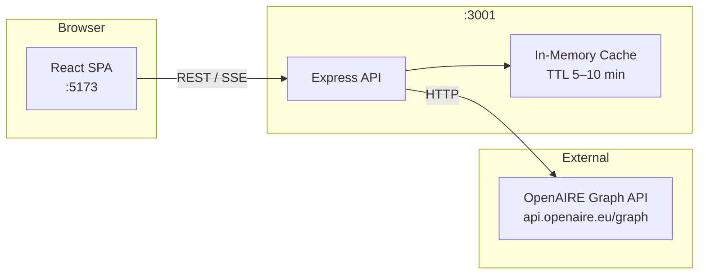

# 🔬 OpenAIRE Explorer Dashboard

> A full-stack research intelligence dashboard for exploring, comparing, and analysing open-access publications, organisations, and projects from the [OpenAIRE Graph](https://graph.openaire.eu/).

[](https://github.com/your-org/openaire-explorer/actions/workflows/ci.yml)
[](LICENSE)
[](https://www.typescriptlang.org/)
[](CONTRIBUTING.md)

<!-- Replace with actual screenshot -->
<!--  -->

---

## ✨ Features

| | Feature |
|---|---|
| 🔍 | **Advanced search** with faceted filtering by type, date range, OA status, and funder |
| ⚖️ | **Multi-entity comparison engine** — compare up to 5 publications, organisations, or projects side-by-side |
| 📊 | **OA distribution analytics** — gold / green / bronze / hybrid / closed breakdown by year |
| 📈 | **Trend analysis** with year-over-year growth rates and publication velocity |
| 🕸️ | **Research network visualisation** — interactive co-authorship and collaboration graphs via Cytoscape.js |
| 🌓 | **Dark / light mode** with system preference detection |
| ♿ | **ARIA-compliant accessibility** — keyboard navigable, screen-reader friendly |
| 📱 | **Mobile-first responsive design** built with Tailwind CSS |

---

## 🚀 Quick Start

### 1) Install dependencies

```bash
git clone https://github.com/your-org/openaire-explorer.git
cd openaire-explorer
npm install
```

### 2) Create the server env file

Use the command that matches your shell:

```bash
# macOS / Linux / Git Bash
cp packages/server/.env.example packages/server/.env
```

```powershell
# PowerShell (Windows)
Copy-Item packages/server/.env.example packages/server/.env
```

### 3) Start the app

```bash
npm run dev
```

The client will be available at **http://localhost:5173**.

The backend listens on **http://localhost:3001**, and the health endpoint is:

- **http://localhost:3001/api/health**

`http://localhost:3001/` returning `{"error":"Not found","code":"NOT_FOUND"}` is expected because routes are under `/api/*`.

### Prerequisites

- Node.js ≥ 20
- npm ≥ 10

---

## 🏗️ Architecture



### Tech Stack

| Layer | Technology |
|---|---|
| Frontend framework | React 19 + TypeScript |
| Routing | React Router v6 (lazy-loaded pages) |
| Data fetching / caching | TanStack Query v5 |
| Charts | Chart.js v4 |
| Network graphs | Cytoscape.js |
| Styling | Tailwind CSS v3 |
| Backend | Express.js + TypeScript |
| Validation | Zod |
| Logging | Pino |
| Monorepo | npm workspaces |
| Build | Vite (client) · tsc (server) |

---

## 📡 API Reference

| Method | Path | Description |
|---|---|---|
| `GET` | `/api/search/research-products` | Search publications, datasets, software |
| `GET` | `/api/search/organizations` | Search research organisations |
| `GET` | `/api/search/projects` | Search funded projects |
| `GET` | `/api/search/research-products/:id` | Fetch single research product |
| `GET` | `/api/search/organizations/:id` | Fetch single organisation |
| `GET` | `/api/search/projects/:id` | Fetch single project |
| `GET` | `/api/search/research-products/:id/related` | Fetch related products |
| `POST` | `/api/compare` | Compare 1–5 entities |
| `GET` | `/api/metrics/oa-distribution` | OA status distribution by year |
| `GET` | `/api/metrics/trends` | Publication trend data |
| `GET` | `/api/metrics/network` | Co-authorship network graph |
| `GET` | `/api/metrics/oa-distribution/stream` | SSE stream of OA distribution |
| `GET` | `/api/health` | Liveness probe |
| `GET` | `/api/health/ready` | Readiness probe (pings OpenAIRE) |

Full documentation with parameters and response shapes: [API.md](API.md)

---

## 📁 Project Structure

```
openaire-explorer/
├── packages/
│   ├── client/               # React SPA (Vite)
│   │   └── src/
│   │       ├── components/   # analytics, comparison, dashboard, detail, layout, search, ui
│   │       ├── contexts/     # ComparisonContext
│   │       ├── hooks/        # TanStack Query hooks per entity/feature
│   │       ├── lib/          # api-client, sentry, web-vitals, widget-registry
│   │       └── pages/        # SearchPage, detail pages, ComparePage, AnalyticsPage
│   ├── server/               # Express API
│   │   └── src/
│   │       ├── lib/          # cache, graph-builder, normalizer, openaire-client, …
│   │       ├── middleware/   # error-handler, validate
│   │       ├── routes/       # search, compare, metrics, health
│   │       └── schemas/      # Zod request schemas
│   └── shared/               # Shared TypeScript types, constants, utils
├── .github/
│   ├── workflows/ci.yml
│   ├── ISSUE_TEMPLATE/
│   └── PULL_REQUEST_TEMPLATE.md
├── render.yaml               # Render.com backend deployment
├── ARCHITECTURE.md
├── API.md
└── CONTRIBUTING.md
```

---

## 🤝 Contributing

Contributions are welcome! Please read [CONTRIBUTING.md](CONTRIBUTING.md) for development setup, branch conventions, and the PR process.

---

## 📄 License

This project is licensed under the [MIT License](LICENSE).
